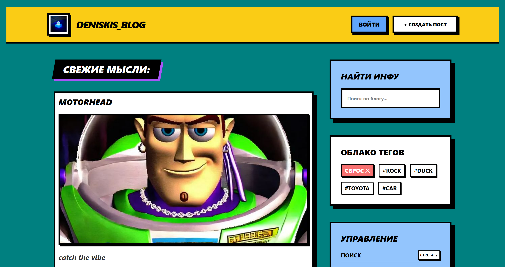
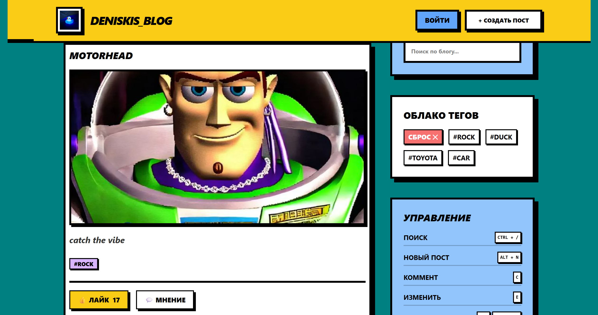
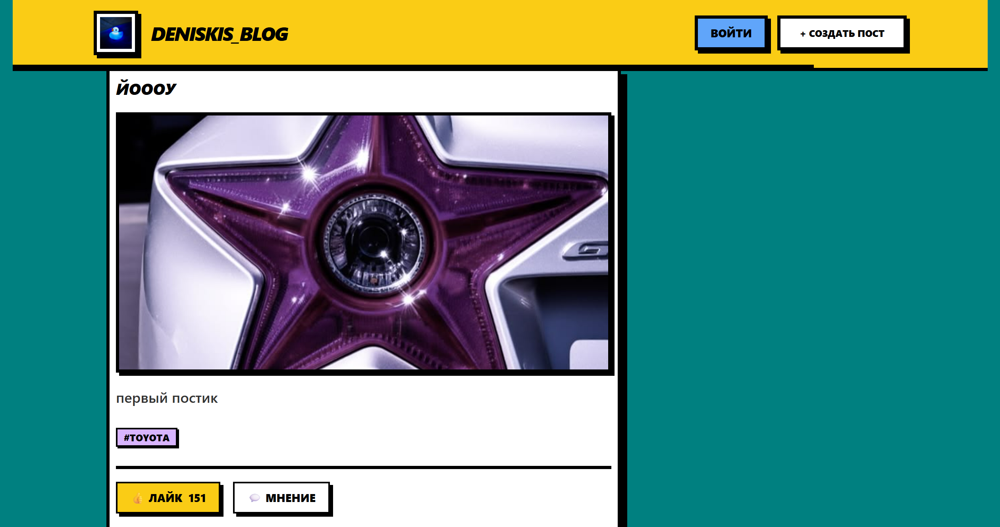
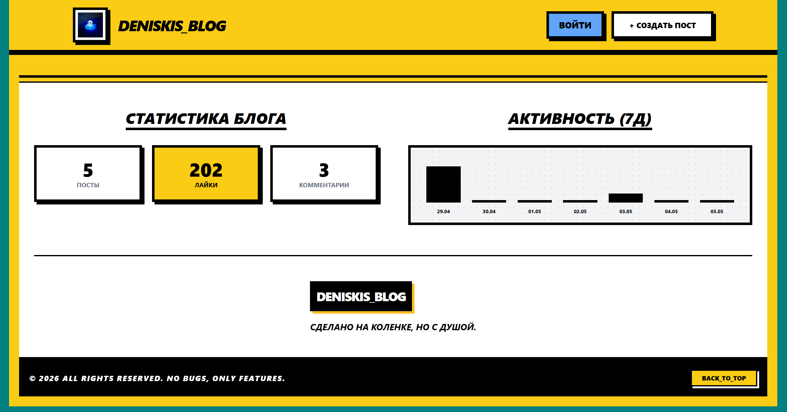
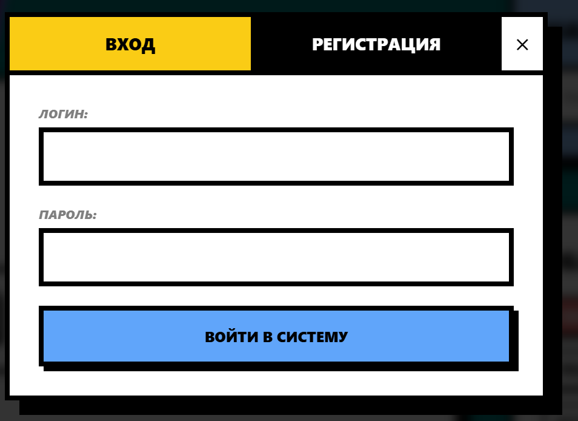
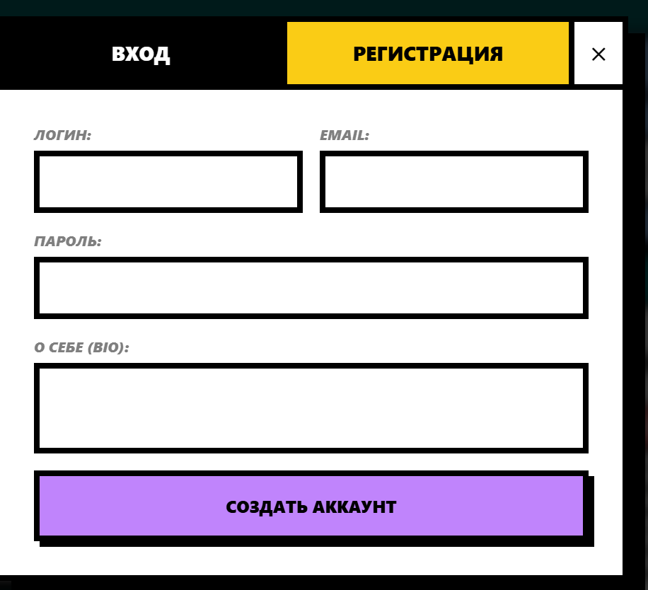
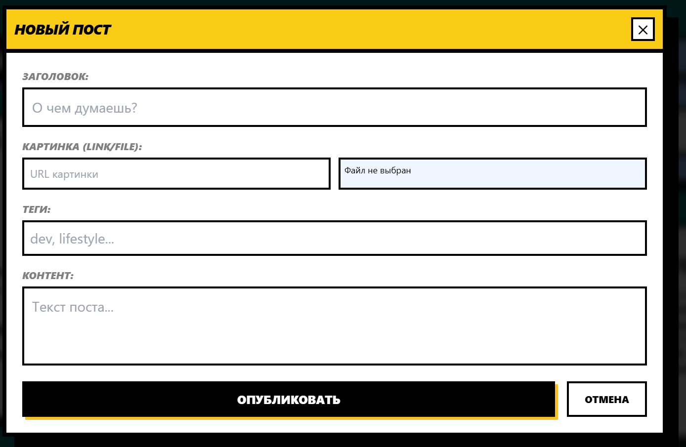
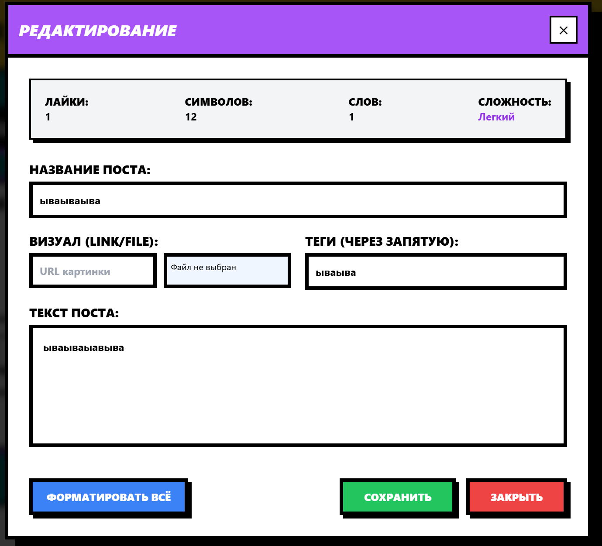
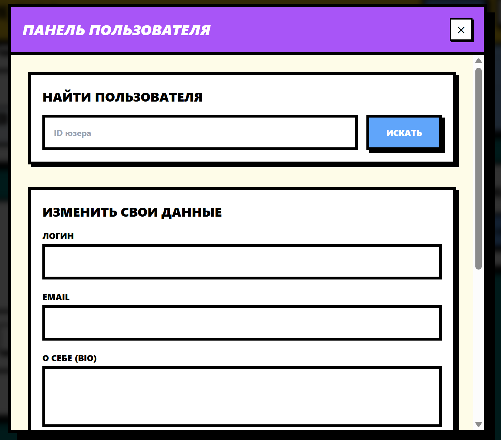
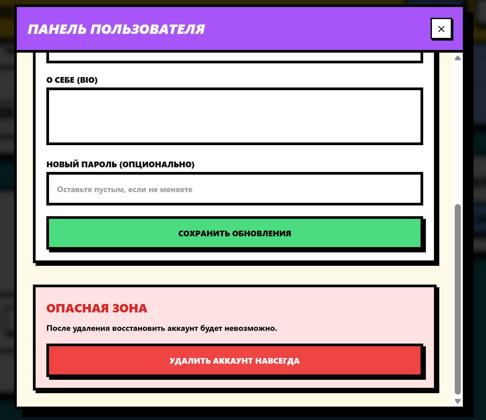

# Документация проекта: "Neo-Brutalism Blog"

## 1. Технологический стек

* **Frontend:** Vanilla TypeScript, Vite, Tailwind CSS.
* **Backend:** ASP.NET Core API (готовое решение от преподавателя).
* **Storage:** LocalStorage (для гибридного хранения метаданных: изображения, теги, лайки).

---

## 2. Архитектура клиента (Feature-Sliced Design)

Проект организован по слоям, где каждый последующий слой может импортировать код только из нижележащих..

### Ключевые слои:

* **Shared:** Переиспользуемый код без привязки к бизнес-логике. Содержит `ApiService` для сетевых запросов и `SaveData` для работы с хранилищем.
* **Entities (Сущности):** Бизнес-модели данных. Пример: `PostDTO`, определяющий структуру поста.
* **Features (Фичи):** Взаимодействия с пользователем, несущие ценность.
* `create-post`: Логика создания и валидации формы.
* `delete-post`: Модальное окно подтверждения и каскадное удаление данных.
* `formatting`: Анализ и предпросмотр форматирования текста.
* `auth`: Формы входа и регистрации.


* **Widgets (Виджеты):** Композиционные блоки (Header, Sidebar, PostList), собирающие фичи в готовые части интерфейса.
* **App:** Инициализация приложения в `main.ts`, глобальные настройки стилей и маршрутизация.

---

## 3. Взаимодействие с API (ASP.NET)

Для работы с сервером используется централизованный `ApiService`. Ниже приведены основные эндпоинты, задействованные в проекте:.

| Сущность | Метод | Эндпоинт | Описание |
| :--- | :--- | :--- | :--- |
| **Keys** | `PUT` | `/keys` | Создание ключа доступа (bio, group) |
| **Users** | `POST` | `/users/auth` | Аутентификация пользователя (логин/пароль) |
| **Users** | `PUT` | `/users` | Регистрация нового пользователя |
| **Users** | `GET` | `/users/{id}` | Получение профиля пользователя по ID |
| **Users** | `POST` | `/users/update` | Обновление данных текущего профиля |
| **Users** | `DELETE` | `/users` | Удаление аккаунта пользователя |
| **Categories** | `GET` | `/categories` | Получение списка всех категорий |
| **Categories** | `PUT` | `/categories` | Создание новой категории (name, slug) |
| **Categories** | `DELETE` | `/categories/{id}` | Удаление категории по ID |
| **Posts** | `POST` | `/posts/getall` | Получение списка постов (с пагинацией и фильтром) |
| **Posts** | `GET` | `/posts/{id}` | Получение детальной информации о посте |
| **Posts** | `PUT` | `/posts` | Создание нового поста |
| **Posts** | `POST` | `/posts/{id}` | Редактирование существующего поста |
| **Posts** | `DELETE` | `/posts/{id}` | Удаление поста по идентификатору |
| **Posts** | `POST` | `/posts/{id}/likes` | Переключение лайка (Toggle Like) |
| **Comments** | `PUT` | `/posts/comments` | Добавление нового комментария к посту |
| **Comments** | `DELETE` | `/posts/comments/{id}` | Удаление комментария по ID |

---

## 4. Запуск проекта и конфигурация

### Предварительные требования

* Node.js (версия 18+)
* Запущенный экземпляр ASP.NET сервера

### Установка и запуск

1. **Клонирование и зависимости:**
```bash
npm i

```


2. **Настройка подключения:**
В файле `src/shared/api/api-service.ts` необходимо убедиться, что `BASE_URL` указывает на адрес вашего сервера (например, `http://localhost:5000`)..
3. **Локальный запуск (Vite):**
```bash
npm run dev

```


### Синхронизация с сервером

При первом запуске `initApp` выполняет запрос `fetchPostsFromApi`.. Если сервер доступен:

* Данные подгружаются в `allPosts`..
* Локальные метаданные (Base64 картинки и теги) мержатся с данными сервера по `id`..
* При отсутствии связи приложение переходит в Offline-режим, используя кэш из `LocalStorage`..

---

## 5. Особенности реализации

* **Гибридное хранение:** Поскольку серверный API ограничен, изображения сохраняются в `LocalStorage` в формате Base64 и привязываются к ID поста, полученному от ASP.NET..
* **Infinite Scroll:** Реализован через `IntersectionObserver` для подгрузки постов порциями по 3 штуки..
* **Neo-Brutalism UI:** Стилизация реализована полностью на Tailwind CSS с использованием кастомных теней и жестких границ..

---

## UI

###  Главная страница






### Статистика на главной странице в футере



### Вход/Регистрация





### Создание поста



### Редактирование поста



### Просмотр профиля



